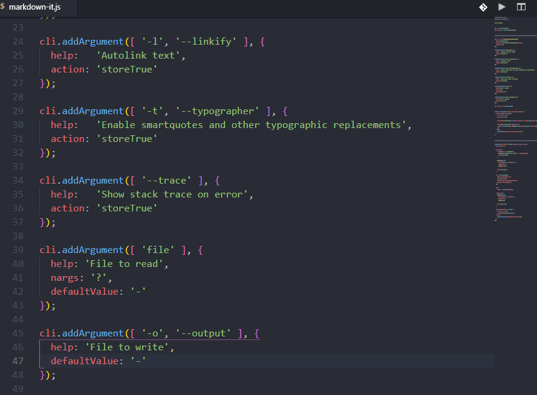

# Select Between

Selects text between brackets or quotes, relative to the caret.

Adds a `Select Between` command that accepts the following: `()[]{}<>'"`, and selects text between them, with caret position as a starting reference.

It reads from keybord input after invoking the command, and doesn't use an input box.

Use a number before usual input to skip a bracket pair in nested brackets of the same type, e.g. `2[`.

